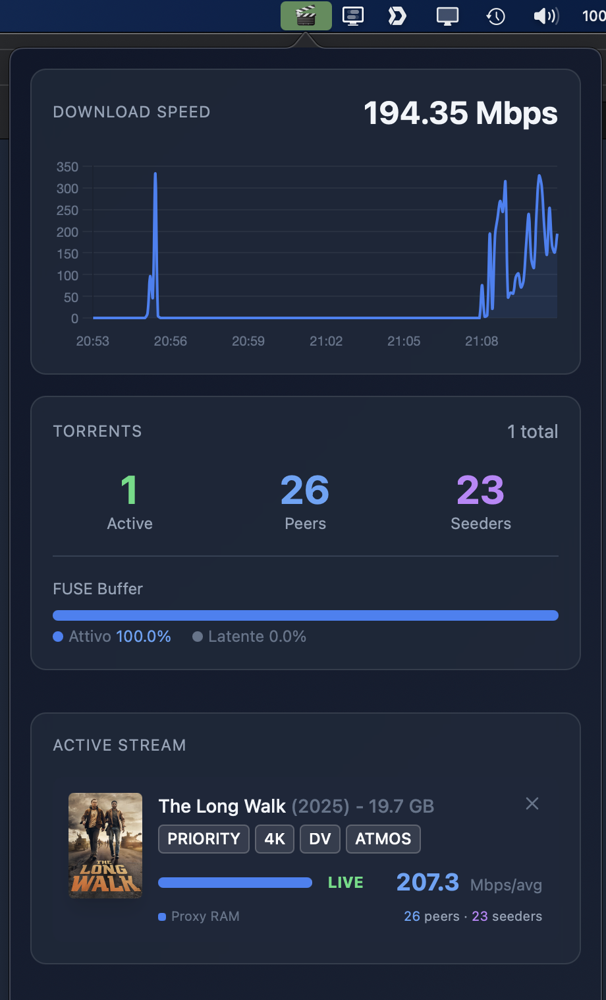
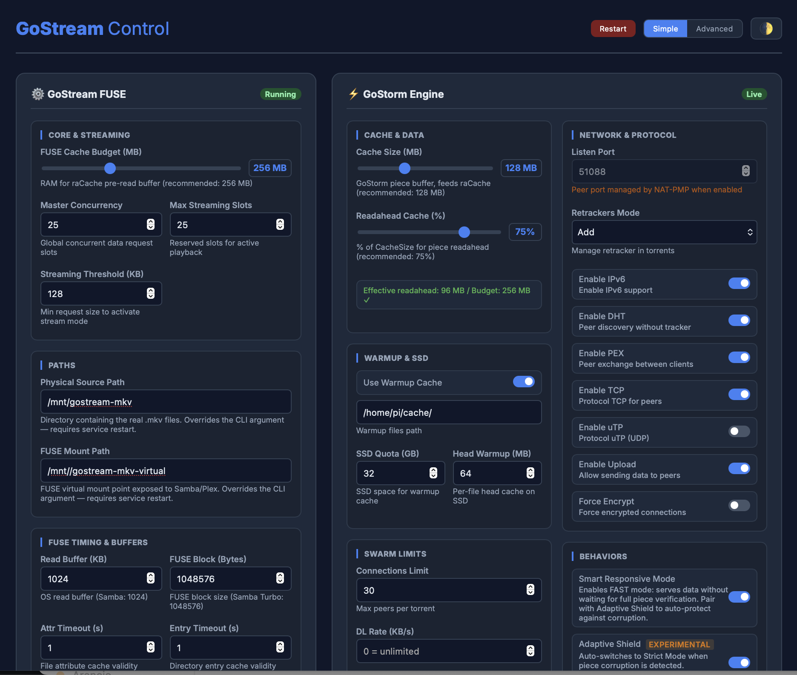

<p align="center">
  <h1 align="center">🎬 GoStream</h1>
  <p align="center">
    <strong>Your Plex library. Every torrent. Instant playback. Nothing ever downloaded.</strong>
  </p>
  <p align="center">
    
    
    
    
    
    
  </p>
</p>

---

GoStream fuses BitTorrent and Plex into a single seamless experience. Add a film to your Plex Watchlist — it appears in your library within the hour and plays instantly, **in 4K HDR Dolby Vision**, fully seekable, from a **Raspberry Pi 4**. No NAS full of files. No download queue. No waiting.

**GoStream is built exclusively for Plex.** It is not a generic torrent client, not a download manager, not a media center. It is a purpose-built streaming engine that makes Plex believe it has a local disk full of MKV files — while underneath, **every byte is served live from a BitTorrent swarm on demand**.

<table>
<tr>
<td align="center"><b>⚡ 0.1 s</b><br/>Warm start (SSD cache)</td>
<td align="center"><b>📉 20% CPU</b><br/>4K HDR on Pi 4</td>
<td align="center"><b>🔥 200+ Mbps</b><br/>Peak throughput</td>
<td align="center"><b>🎯 −87%</b><br/>CPU vs baseline</td>
<td align="center"><b>💾 33 MB</b><br/>Single binary</td>
</tr>
</table>

---

## 📸 Screenshots





---

## 📖 Table of Contents

- [How the Magic Works](#-how-the-magic-works)
- [Architecture](#-architecture)
- [Core Engineering](#-core-engineering)
- [Performance](#-performance)
- [Requirements](#-requirements)
- [Quick Install](#-quick-install)
- [How-To Guide](#-how-to-guide)
- [Control Panel](#-gostream-control-panel)
- [Health Monitor](#-health-monitor-dashboard)
- [Configuration Reference](#-configuration-reference)
- [Sync Scripts](#-sync-scripts)
- [Plex & Samba Setup](#-plex-and-samba-setup)
- [Build from Source](#-build-from-source)
- [API Reference](#-api-quick-reference)
- [Troubleshooting](#-troubleshooting)
- [License](#-license)

---

## 🪄 How the Magic Works

GoStream exposes a **custom FUSE virtual filesystem** where each `.mkv` file is a live torrent, presented to Plex exactly like a normal file on disk. The bytes Plex requests are resolved in real time from a three-layer cache:

| Layer | What | Size | Purpose |
|-------|------|------|---------|
| **L1** | In-memory Read-Ahead | 256 MB | 32-shard concurrent buffer with per-shard LRU |
| **L2** | SSD Warmup Head | 64 MB/file | Instant metadata + TTFF on replay |
| **L3** | SSD Warmup Tail | 16 MB/file | MKV Cues (seek index) for instant seek-bar rendering |

The BitTorrent engine runs **inside the same process** as the FUSE layer — no HTTP proxy, no TCP socket, no serialization. Just memory.

This is not a wrapper around an existing FUSE filesystem. The FUSE layer was designed from scratch around the constraints of torrent streaming: byte-range requests that arrive out of order, multi-gigabyte files that must be seekable at any position, and a Plex scanner that probes every file in the library on startup.

### Plex Watchlist → Instant Library

The sync scripts close the loop:

1. **Every hour** → GoStream checks your Plex cloud Watchlist, finds the best torrent for each title via Torrentio (4K DV preferred), registers it with the engine
2. **Every day** → TMDB Discover + Popular (Italian + English) auto-fills your library with trending titles
3. **Every week** → TV series sync with fullpack-first approach and season pack structure
4. On Plex library scan → the film appears. Press play → GoStream wakes the torrent, connects to peers, serves bytes. **Nothing ever stored on disk** beyond the 64 MB warmup head and the BoltDB torrent registry.

---

## 🏗️ Architecture

```
BitTorrent Peers ←→ GoStorm Engine (:8090)
                         │
              Native Bridge (In-Memory Pipe)
              Zero-Network, Zero-Copy Hot Path
                         │
         ┌───────────────────────────────────┐
         │        FUSE Proxy Layer           │
         │  L1: Read-Ahead Cache (256 MB)    │
         │  L2: SSD Warmup Head (64 MB/file) │
         │  L3: SSD Warmup Tail (16 MB/file) │
         └───────────────────────────────────┘
                         │
         /mnt/gostream-mkv-virtual/*.mkv  (FUSE mount)
                         │
         Samba share (smbd, oplocks=no, vfs objects=fileid)
                         │
         Synology CIFS mount (serverino, vers=3.0)
                         │
         Plex Media Server libraries
```

GoStream runs as a **single process**. The GoStorm BitTorrent engine and the FUSE proxy layer are compiled into one binary and communicate via an in-process `io.Pipe()` — no TCP sockets, no HTTP stack, no serialization on the data path. Metadata operations are direct Go function calls.

### Port Map

| Port | Purpose |
|------|---------|
| `:8080` | FUSE Proxy HTTP endpoint |
| `:8090` | GoStorm API — JSON torrent management |
| `:8096` | Metrics, Control Panel, Plex Webhook |
| `:8095` | Health Monitor Dashboard (Python, separate process) |

---

## ⚙️ Core Engineering

> **11 purpose-built subsystems**, each solving a real problem encountered during development on Raspberry Pi 4 hardware.

### 1. 🔗 Zero-Network Native Bridge

The FUSE proxy and GoStorm engine run in the **same OS process**. When Plex reads a `.mkv` byte range, the FUSE layer calls directly into the GoStorm engine via an in-memory `io.Pipe()`. There is no TCP round-trip, no HTTP header parsing, no serialization. This eliminates the network RTT that causes stuttering in HTTP-based torrent streaming proxies on constrained hardware.

### 2. 💽 Two-Layer SSD Warmup Cache

- **Head cache** — The first 64 MB of each file is written to SSD on first play. Repeat TTFF: **< 0.01 s** (SSD at 150–200 MB/s, vs. 2–4 s for cold torrent activation).
- **Tail cache** — The last 16 MB is cached separately. MKV files store their Cues (seek index) near the end. Without tail cache, Plex probes the end of the file before confirming playback and the seek bar renders as unavailable.
- **Quota**: 32 GB default, LRU eviction by write-time mtime (~150 films cached simultaneously).
- **Auto-population**: Plex library scans read the first 1 MB of every file — enough to populate warmup heads automatically; no manual warming step.
- **Storage**: `{install_dir}/STATE/warmup/`

### 3. 🎯 Plex Webhook Integration & Smart Streaming

GoStream embeds a webhook receiver at `:8096/plex-webhook`. When Plex sends a `media.play` event:

1. **IMDB extraction** — Extracts the IMDB ID from the raw JSON payload using `imdb://(tt\d+)` regex *before* `json.Unmarshal`. This is intentional: Plex uses a non-standard `Guid` array format that causes a silent `UnmarshalTypeError` when decoded normally.
2. **Priority Mode** — GoStorm is instructed to aggressively prioritize pieces covering the exact byte range being played.
3. **Tail freeze** — The MKV Cues segment is not evicted while the film is playing.
4. **Fast-drop on stop** — Torrent retention shrinks from 60 s to 10 s, freeing peers immediately.

> 💡 **Why IMDB-ID?** Plex sends titles in the user's display language (`"den stygge stesøsteren"` instead of `"The Ugly Stepsister"`). Fuzzy matching fails. IMDB ID is language-independent.

**Configure in Plex**: Settings → Webhooks → Add Webhook:
```
http://<your-pi-ip>:8096/plex-webhook
```

### 4. 🛡️ Adaptive Responsive Shield

Two read modes, automatically managed:

| Mode | Behavior | When |
|------|----------|------|
| **Responsive** *(default)* | Data served before SHA1 verification — instant start | Normal operation |
| **Strict** | Only SHA1-verified pieces served | Automatically activated for 60 s on corruption detection |

If a corrupt piece is detected (`MarkNotComplete()`), the Adaptive Shield activates Strict Mode for 60 seconds, then automatically restores Responsive. Transition tracked via atomic boolean — **zero mutex contention** on the hot read path.

### 5. 🎮 Seek-Master Architecture

Accurate, low-latency seeking in large 4K files required five coordinated fixes:

| Fix | What it does |
|-----|-------------|
| **Eager offset update** | Updates `lastOff` before the cache check — pump sees target on the same `Read()` call |
| **Atomic pipe interrupt** | `Interrupt()` closes the pipe reader atomically when the player jumps > 256 MB — instant unblock from `io.ReadFull` |
| **Reactive jump** | If player is > 256 MB ahead of pump, snap to `(playerOff / chunkSize) * chunkSize` |
| **Pump survival** | Pump survives `ErrInterrupted` via 200 ms sleep-and-continue — no goroutine restart overhead |
| **Tail probe detection** | Plex's end-of-file MKV Cues probes served from SSD tail cache without steering the pump |

### 6. 🧩 32-Shard Read-Ahead Cache

The 256 MB read-ahead budget is distributed across **32 independent shards**, keyed by hash of file path + offset. Each shard has its own LRU and mutex. This eliminates global lock contention when multiple Plex sessions or scanner threads read concurrently. All pool operations use **defensive copies** on both `Put()` and `Get()` to prevent use-after-free races.

### 7. 🤖 Automated Content Ecosystem

Three Python sync scripts form a self-maintaining library:

| Script | Trigger | What it does |
|--------|---------|-------------|
| `gostorm-sync-complete.py` | Daily cron | TMDB Discover + Popular → Torrentio → GoStorm → virtual `.mkv` |
| `gostorm-tv-sync.py` | Weekly cron | TV series with fullpack-first approach |
| `plex-watchlist-sync.py` | Hourly cron | Plex cloud watchlist → IMDB → Torrentio → GoStorm |
| `health-monitor.py` | Persistent service | Real-time dashboard at `:8095` |

**Quality ladder**: `4K DV > 4K HDR10+ > 4K HDR > 4K > 1080p REMUX > 1080p`\
**Minimum seeders**: 20 (main sync), 10 (watchlist sync, for older films)

### 8. 🌐 NAT-PMP Native VPN Port Forwarding

Integrated as a sidecar goroutine. On startup (and periodically), GoStream requests a TCP+UDP port mapping from the VPN gateway via NAT-PMP, installs `iptables PREROUTING REDIRECT` rules, and updates GoStorm's `PeersListenPort` — all without a restart.

| Configuration | Speed | Peers |
|--------------|-------|-------|
| WireGuard only | 3–6 Mbps | 8–10 |
| **WireGuard + NAT-PMP** | **15–21 Mbps** | **19–20** |
| AMZN WEB-DL torrents | 140–198 Mbps | 23–25 |

### 9. 🚫 IP Blocklist — ~700k Ranges

Auto-downloads and periodically refreshes a gzipped BGP/country blocklist. Injected directly into anacrolix/torrent's IP filter — blocks known-bad actors before any connection attempt. Refresh: 24 h.

### 10. 🚀 Profile-Guided Optimization (PGO)

Binary compiled with `-pgo=auto`. Go 1.24 reads `default.pgo` to inline hot paths and optimize branch prediction from real production profiling data. On Pi 4 Cortex-A72 (no hardware AES/SHA1): **~5–7% CPU reduction** from PGO alone.

### 11. 🔧 GoStorm Engine — Deep Fork

GoStorm is a fork of anacrolix/torrent v1.55 + TorrServer, with **substantial modifications**:

<details>
<summary><b>Click to expand — 15+ targeted optimizations</b></summary>

| Optimization | Problem → Solution |
|---|---|
| **O(1) `AddTorrent` DB write** | Original rewrote all 520 torrents on every add (O(N) fsync). Fixed to single `tdb.Set()`. |
| **O(1) `GetTorrentDB`** | Original called `ListTorrent()` + 520 unmarshals to find one torrent. Fixed to direct key lookup. |
| **InfoBytes + PeerAddrs caching** | `TorrentSpec.InfoBytes` was never persisted — re-activation required full metadata fetch. Now saved on `Wake()`. |
| **Request rebuild debounce** | 300 rebuilds/s reduced to 60 → **5x CPU reduction**. |
| **O(1) `clearPriority`** | Original iterated all ~512 cached pieces with global lock. Replaced with `localPriority` map tracking ~25 active pieces. |
| **4 MB MemPiece buffer zeroing** | Channel pools reused buffers without zeroing → stale data from different files caused forward-jump corruption. Fixed with `clear(p.buffer)`. |
| **raCache defensive copies** | `Get()` returned sub-slices of pooled buffers. On eviction, Plex received overwritten data. Fixed with copies on `Put()` and `Get()`. |
| **`cleanTrigger` panic fix** | `Cache.Close()` closed the channel while goroutines could still send → panics during peer upload. Fixed with separate `cleanStop` channel. |
| **`PeekTorrent` discipline** | Monitoring endpoints using `GetTorrent()` caused silent torrent activation loops. All monitoring paths now use `PeekTorrent()`. |
| **InodeMap GC fix** | Inode cleanup pruned virtual MKV stubs every 5 min (529 files). Fixed to use `WalkDir(physicalSourcePath)`. |
| **8 additional race condition fixes** | Concurrent map writes, torn reads, nil pointer dereferences across `requesting.go`, `piece.go`, `cache.go`, `apihelper.go`. |

</details>

---

## 📊 Performance

> All measurements on **Raspberry Pi 4** (4 GB RAM, Cortex-A72, arm64, no hardware crypto).

| Metric | Value |
|--------|-------|
| Cold start (first play, no warmup) | 2–4 s |
| Warm start (SSD warmup HIT) | **0.1–0.5 s** |
| Seek latency (cached position) | **< 0.01 s** |
| CPU at 4K HDR streaming | **20–23%** of one core |
| CPU reduction vs. baseline | **−87%** (161% → 20%) |
| Binary size | **33 MB** (60% smaller than legacy builds) |
| Memory footprint (read-ahead) | Deterministic 256 MB |
| GOMEMLIMIT | 2200 MiB |
| Peak throughput (NAT-PMP + fast seeder) | **200+ Mbps** |
| Plex scan peer count | ~6 total (was ~15,000 before fix) |
| Inode shard count | 32 (collision-protected) |
| Warmup cache capacity | ~150 films at 64 MB each (32 GB) |

---

## 📋 Requirements

| Component | Details |
|-----------|---------|
| **Hardware** | Raspberry Pi 4 with arm64 OS (4 GB RAM recommended) |
| **Go** | 1.24+ — must be `linux/arm64` toolchain, **not** `linux/arm` (32-bit) |
| **Python** | 3.9+ with pip3 |
| **FUSE 3** | `sudo apt install fuse3 libfuse3-dev` |
| **systemd** | For service management |
| **Samba** | `sudo apt install samba` |
| **Plex** | Media Server (on Synology or any network host) |
| **TMDB API key** | Free at [themoviedb.org/settings/api](https://www.themoviedb.org/settings/api) |
| **Plex token** | Settings → Account → XML API |

---

## 🚀 Quick Install

```bash
git clone https://github.com/MrRobotoGit/gostream gostream
cd gostream
chmod +x install.sh
./install.sh
```

The interactive installer:
1. Prompts for all required paths, Plex credentials, TMDB key, and NAT-PMP settings
2. Generates `config.json` from `config.json.example`
3. Installs Python dependencies from `requirements.txt`
4. Creates `STATE/`, `logs/`, and FUSE mount point directories
5. Writes and enables systemd services for `gostream` and `health-monitor`
6. Optionally configures cron jobs for sync scripts

After installation, build the binary (see [Build from Source](#-build-from-source)) and deploy:

```bash
cp gostream /home/pi/GoStream/gostream
sudo systemctl start gostream health-monitor
```

---

## 📘 How-To Guide

<details>
<summary><b>Step 1 — Configure the Plex Webhook</b></summary>

In Plex Web: **Settings → Webhooks → Add Webhook**:

```
http://192.168.1.2:8096/plex-webhook
```

Required for Priority Mode (bitrate boost during playback), fast-drop on stop, and IMDB-ID-based file matching.

Test connectivity:
```bash
curl -X POST http://192.168.1.2:8096/plex-webhook \
  -H 'Content-Type: application/json' \
  -d '{"event":"media.play"}'
```

</details>

<details>
<summary><b>Step 2 — Configure the Plex Library</b></summary>

Add a Movies library in Plex pointing to the Samba share:
```
smb://192.168.1.2/gostream-mkv-virtual/movies
```
Or, if using Synology, point Plex to the CIFS mount: `/volume1/GoStream/movies`.

Run a library scan after adding the library. Plex reads the first megabyte of every `.mkv` file during the scan — this automatically populates the SSD warmup head cache for every title. Subsequent plays will start in under 0.5 seconds.

</details>

<details>
<summary><b>Step 3 — Add Your First Movie</b></summary>

**Manually via API:**
```bash
curl -X POST http://127.0.0.1:8090/torrents \
  -H "Content-Type: application/json" \
  -d '{"action":"add","link":"magnet:?xt=urn:btih:...","title":"Interstellar (2014)"}'
```

**Via sync scripts (recommended):**
```bash
python3 /home/pi/GoStream/scripts/gostorm-sync-complete.py
```
The script fetches popular films from TMDB, finds the best available torrent for each via Torrentio, adds them to GoStorm, and writes virtual `.mkv` stub files.

</details>

<details>
<summary><b>Step 4 — Watch a Film (What Happens Internally)</b></summary>

```
1. Plex requests /mnt/gostream-mkv-virtual/movies/Interstellar.mkv
2. FUSE Open() triggers Wake() — GoStorm activates the torrent (instant with warmup HIT)
3. Plex metadata probes → served from SSD head warmup cache (< 0.01 s)
4. Plex probes MKV Cues at end → served from SSD tail cache
5. Plex sends media.play webhook → GoStream activates Priority Mode
6. Streaming reads → served from Read-Ahead Cache or Native Bridge pump
7. Playback begins in 0.1–0.5 s ✨
```

</details>

<details>
<summary><b>Step 5 — Seek in 4K</b></summary>

When Plex seeks to a new timestamp:

1. `Read()` is called at the new offset — `lastOff` is updated immediately
2. If the jump exceeds 256 MB: `Interrupt()` closes the pipe — pump goroutine unblocks atomically
3. Pump detects `lastOff` is > 256 MB ahead — snaps to aligned chunk position
4. Pump restarts via `startStream(newOff)` — GoStorm repositions torrent reader
5. Data arrives from peers or SSD cache within seconds

The pump goroutine survives `ErrInterrupted` — it sleeps 200 ms and continues the read loop, so no goroutine restart overhead.

</details>

<details>
<summary><b>Step 6 — Add from Your Plex Watchlist</b></summary>

Add any movie to your Plex cloud watchlist (desktop or mobile app). Within one hour (hourly cron):

```bash
python3 /home/pi/GoStream/scripts/plex-watchlist-sync.py
```

The script:
1. Queries `discover.provider.plex.tv` for your watchlist
2. Resolves each entry to an IMDB ID (falls back to TMDB)
3. Queries Torrentio for the best stream (minimum 10 seeders)
4. Adds to GoStorm and writes a virtual `.mkv` stub

Test without making changes:
```bash
python3 /home/pi/GoStream/scripts/plex-watchlist-sync.py --dry-run --verbose
```

</details>

<details>
<summary><b>Step 7 — Monitor in Real Time</b></summary>

```bash
# Control Panel — GoStream + GoStorm settings, paths, restart button
open http://192.168.1.2:8096/control

# Health Dashboard — speed graph, torrent stats, active stream, log viewer
open http://192.168.1.2:8095

# Raw metrics (JSON)
curl -s http://192.168.1.2:8096/metrics | python3 -m json.tool

# Live log — key events only
ssh pi@192.168.1.2 "tail -f /home/pi/logs/gostream.log | grep -E '(OPEN|NATIVE|Interrupt|Jump|DiskWarmup|Emergency)'"

# Active torrents in RAM with speed
curl -s -X POST -H 'Content-Type: application/json' \
  -d '{"action":"active"}' http://192.168.1.2:8090/torrents | \
  jq '.[] | {title: .title[:60], speed_mbps: ((.download_speed//0)/1048576|round), peers: (.active_peers//0)}'
```

</details>

<details>
<summary><b>Step 8 — Set Up Cron Jobs</b></summary>

```bash
crontab -e
```

Add:

```cron
# Plex Watchlist sync — every hour
0 * * * * /usr/bin/python3 /home/pi/GoStream/scripts/plex-watchlist-sync.py >> /home/pi/logs/watchlist-sync.log 2>&1

# Full movie sync — daily at 3 AM
0 3 * * * /usr/bin/python3 /home/pi/GoStream/scripts/gostorm-sync-complete.py >> /home/pi/logs/gostorm-debug.log 2>&1

# TV sync — every Sunday at 4 AM
0 4 * * 0 /usr/bin/python3 /home/pi/GoStream/scripts/gostorm-tv-sync.py >> /home/pi/logs/gostorm-tv-sync.log 2>&1
```

</details>

<details>
<summary><b>Step 9 — Tune GoStorm Settings</b></summary>

Via the Control Panel at `:8096/control`, or via API:

```bash
curl -X POST http://127.0.0.1:8090/settings \
  -H "Content-Type: application/json" \
  -d '{
    "action": "set",
    "sets": {
      "CacheSize": 67108864,
      "ReaderReadAHead": 95,
      "PreloadCache": 0,
      "ConnectionsLimit": 25,
      "TorrentDisconnectTimeout": 10,
      "UseDisk": true,
      "ResponsiveMode": true
    }
  }'
```

| Setting | Value | Rationale |
|---------|-------|-----------| 
| `CacheSize` | 64 MB | Lean engine strategy — feed FUSE 256 MB buffer; smaller heap = lower GC |
| `ConnectionsLimit` | 25 | Matches FUSE master semaphore; prevents Samba thread exhaustion |
| `ResponsiveMode` | `true` | Serve unverified data; Adaptive Shield corrects corruption automatically |
| `UseDisk` | `true` | Enable SSD warmup cache |
| `TorrentDisconnectTimeout` | 10 s | Fast peer cleanup for RAM footprint |

</details>

<details>
<summary><b>Step 10 — Regenerate the PGO Profile</b></summary>

Capture a CPU profile during real streaming workload:

```bash
# Single profile (120 seconds while streaming a 4K film)
curl -o /home/pi/gostream/default.pgo \
  "http://127.0.0.1:8096/debug/pprof/profile?seconds=120"

# Or merge multiple workloads for better coverage
curl -o /tmp/pgo-stream.pprof "http://127.0.0.1:8096/debug/pprof/profile?seconds=120"
curl -o /tmp/pgo-sync.pprof   "http://127.0.0.1:8096/debug/pprof/profile?seconds=120"
go tool pprof -proto /tmp/pgo-stream.pprof /tmp/pgo-sync.pprof > /home/pi/gostream/default.pgo

# Rebuild — Go detects the changed profile and re-optimizes automatically
cd /home/pi/gostream
GOARCH=arm64 CGO_ENABLED=1 /usr/local/go/bin/go build -pgo=auto -o gostream .
```

Regenerate after significant code changes. On Pi 4 Cortex-A72, `sha1.blockGeneric` in the profile is expected — the A72 has no hardware SHA1 extensions.

</details>

---

## 🎛️ GoStream Control Panel

The Control Panel is a web UI **embedded in the GoStream binary** — no additional server, no React build step, no external dependencies. Served at `:8096/control`.

```
http://<your-pi-ip>:8096/control
```

### Simple / Advanced Mode

A toggle in the top-right corner switches between two views:

- **Simple** — Most frequently changed settings: read-ahead budget, concurrency, cache size, paths, and NAT-PMP toggle
- **Advanced** — All tunable parameters, split into labelled groups across two panels

### GoStream FUSE Panel (left)

Settings are written to `config.json` and require a **service restart**. The **Restart** button in the header triggers an immediate restart.

| Group | Settings |
|-------|----------|
| **Core & Streaming** | ReadAhead Budget (MB), Master Concurrency, Max Streaming Slots, Streaming Threshold (KB) |
| **Paths** | Physical Source Path (Samba root), FUSE Mount Path |
| **FUSE Timing & Buffers** | Read Buffer (KB), FUSE Block Size, Attr/Entry Timeout (s) |
| **Cache Management** | Metadata Cache (MB), Max Cache Entries, Cleanup Interval (min) |
| **Connectivity & Rescue** | GoStorm URL, Rescue Grace/Cooldown, Metrics Port, Log Level, Proxy Port, BlockList URL |

### GoStorm Engine Panel (right)

Settings are pushed **live via API** — no restart needed. **Apply All Core Settings** sends values immediately.

| Group | Settings |
|-------|----------|
| **Cache & Data** | Cache Size (MB), Readahead Cache (%), Preload Cache (%) |
| **Warmup & SSD** | Use Warmup Cache, Warmup path, SSD Quota (GB), Head Warmup (MB) |
| **Swarm Limits** | Connections Limit, DL/UP Rate (KB/s), Disconnect Timeout (s) |
| **Network & Protocol** | Listen Port, Retrackers Mode, IPv6/DHT/PEX/TCP/uTP/Upload/Force Encrypt |
| **NAT-PMP (WireGuard)** | Enable, Gateway IP, VPN Interface, Refresh/Lifetime (s), Local Port |
| **Behaviors** | Smart Responsive Mode, Debug Log |

---

## 📈 Health Monitor Dashboard

Standalone Python service (`health-monitor.py`) at port **`:8095`**. Real-time operational view of the entire stack.

```
http://<your-pi-ip>:8095
```

### Status Grid

Six cards in a 2×3 grid:

| Card | What it shows |
|------|--------------| 
| **GOSTORM** | API ping latency (green = responding). Restart button. |
| **FUSE MOUNT** | Number of virtual `.mkv` files currently exposed. |
| **VPN (WG0)** | WireGuard interface status: VPN IP and gateway. |
| **NAT-PMP** | Active external port assigned by VPN gateway. |
| **PLEX** | Server version and reachability. |
| **SYSTEM** | CPU %, RAM %, free disk space — live via `psutil`. |

### Download Speed Graph

**15-minute rolling chart** of GoStorm download speed in Mbps. Samples every few seconds with auto-scroll.

### Active Stream Panel

Appears automatically during playback:
- 🎬 **Movie poster** (fetched from TMDB)
- 🏷️ **Quality badges**: `PRIORITY`, `4K`, `DV`, `ATMOS`, `HDR10+`
- 📡 **LIVE indicator** + 5-minute average speed
- 💾 **Source indicator**: `Proxy RAM` or `Warmup SSD`
- 👥 **Peer/seeder count** for the active torrent

### Sync Controls

Two panels for manual sync execution without SSH:
- **MOVIES SYNC** — Triggers `gostorm-sync-complete.py` with live SSE log streaming
- **TV SYNC** — Triggers `gostorm-tv-sync.py` with Start/Idle status

---

## ⚙️ Configuration Reference

`config.json` is resolved relative to the binary's path (`os.Executable()`). No path argument needed. Not tracked by git (contains credentials).

```bash
cp config.json.example /home/pi/GoStream/config.json
nano /home/pi/GoStream/config.json
```

### Full Field Reference

| Field | Default | Description |
|-------|---------|-------------|
| `physical_source_path` | — | Directory where virtual `.mkv` stubs are created |
| `fuse_mount_path` | — | FUSE mount point — seekable virtual files served here |
| `read_ahead_budget_mb` | `256` | In-memory read-ahead budget |
| `disk_warmup_quota_gb` | `32` | SSD cache quota (~150 films at 64 MB each) |
| `warmup_head_size_mb` | `64` | Per-file SSD warmup size |
| `master_concurrency_limit` | `25` | Max concurrent data slots |
| `gostorm_url` | `http://127.0.0.1:8090` | GoStorm internal API URL |
| `proxy_listen_port` | `8080` | FUSE proxy HTTP port |
| `metrics_port` | `8096` | Metrics, Control Panel, Webhook port |
| `blocklist_url` | *(BT_BlockLists)* | Gzipped IP blocklist URL (24 h refresh) |
| `plex.url` | — | Plex server URL |
| `plex.token` | — | Plex authentication token |
| `plex.library_id` | — | Plex movie library section ID |
| `tmdb_api_key` | — | TMDB API key |
| `natpmp.enabled` | `false` | Enable NAT-PMP |
| `natpmp.gateway` | — | VPN gateway IP |
| `natpmp.vpn_interface` | `wg0` | WireGuard interface |

### Runtime Environment Variables

```ini
Environment="GOMEMLIMIT=2200MiB"
Environment="GOGC=100"
```

`GOMEMLIMIT=2200MiB` leaves headroom for OS, Samba, and Python scripts on a 4 GB Pi 4.

---

## 🔄 Sync Scripts

All scripts in `scripts/` resolve `config.json` from the parent directory automatically. Override with `MKV_PROXY_CONFIG_PATH`.

### `gostorm-sync-complete.py` — Daily Movie Sync

Queries TMDB Discover + Popular (Italian + English, region IT+US), evaluates Torrentio results, adds the best torrent.

```bash
python3 scripts/gostorm-sync-complete.py
```

- Quality: `4K DV > 4K HDR10+ > 4K HDR > 4K > 1080p REMUX > 1080p`
- Min seeders: 20 · Min size: 10 GB (4K), 3 GB (1080p)
- Skips existing films (by TMDB ID) · Upgrades lower-quality entries

### `gostorm-tv-sync.py` — Weekly TV Sync

```bash
python3 scripts/gostorm-tv-sync.py
```

Fullpack-first approach — prefers complete season packs. Plex-compatible directory structure:
```
Show Name/
  Season.01/
    Show.Name_S01E01_<hash>.mkv
    Show.Name_S01E02_<hash>.mkv
```

### `plex-watchlist-sync.py` — Hourly Watchlist Sync

```bash
python3 scripts/plex-watchlist-sync.py [--dry-run] [--verbose]
```

Reads Plex cloud watchlist → IMDB ID resolution → Torrentio (min 10 seeders) → GoStorm.

### `health-monitor.py` — Dashboard

```bash
python3 scripts/health-monitor.py
# or: sudo systemctl start health-monitor
```

Real-time dashboard at `:8095`. See [Health Monitor Dashboard](#-health-monitor-dashboard).

---

## 🔌 Plex and Samba Setup

### Samba Configuration

Critical parameters in `/etc/samba/smb.conf` to prevent FUSE deadlocks during Plex library scans:

```ini
[gostream-mkv-virtual]
   path = /mnt/gostream-mkv-virtual
   browseable = yes
   read only = yes
   oplocks = no           # CRITICAL: prevents kernel exclusive locks on FUSE files
   aio read size = 1      # CRITICAL: forces async I/O, prevents smbd D-state
   deadtime = 15          # cleans inactive SMB connections every 15 minutes
   vfs objects = fileid   # CRITICAL: transmits 64-bit inodes to Synology/Plex
```

> [!WARNING]
> **`oplocks = no` is non-negotiable.** With oplocks enabled, the kernel requests exclusive locks on FUSE-backed files, causing `smbd` threads to enter D-state indefinitely during concurrent Plex scans.

> [!IMPORTANT]
> **`vfs objects = fileid`** ensures 64-bit inode transmission. Without it, Synology receives truncated 32-bit inodes, causing Plex to misidentify files.

### Synology CIFS Mount

```
Source:  //pi-ip/gostream-mkv-virtual
Target:  /volume1/GoStream
Options: serverino,vers=3.0,uid=1024,gid=100,file_mode=0777,dir_mode=0777
```

`serverino` must remain active. Synology may silently drop it after network timeouts. Schedule a Task Scheduler job (every 5 min) to verify and remount if needed.

---

## 🛠️ Build from Source

> [!IMPORTANT]
> Compile natively on Pi 4 (arm64). Do not cross-compile — the PGO profile must match the target architecture.

```bash
ssh pi@192.168.1.2
cd /home/pi/gostream

/usr/local/go/bin/go clean -cache
/usr/local/go/bin/go mod tidy
GOARCH=arm64 CGO_ENABLED=1 /usr/local/go/bin/go build -pgo=auto -o gostream .

# Deploy
sudo systemctl stop gostream
cp gostream /home/pi/GoStream/gostream
sudo systemctl start gostream
```

**Verify the toolchain is 64-bit:**
```bash
/usr/local/go/bin/go version
# ✅ Required: go version go1.24.x linux/arm64
# ❌ Wrong:    go version go1.24.x linux/arm   <-- 32-bit
```

**Install Go 1.24 if needed:**
```bash
wget https://go.dev/dl/go1.24.0.linux-arm64.tar.gz
sudo tar -C /usr/local -xzf go1.24.0.linux-arm64.tar.gz
```

---

## 📡 API Quick Reference

### GoStorm API (`:8090`)

```bash
# List all torrents (count)
curl -s -X POST -H 'Content-Type: application/json' \
  -d '{"action":"list"}' http://127.0.0.1:8090/torrents | jq length

# Add a torrent
curl -X POST -H 'Content-Type: application/json' \
  -d '{"action":"add","link":"magnet:?xt=urn:btih:...","title":"Film Title (Year)"}' \
  http://127.0.0.1:8090/torrents

# Active torrents (in RAM, not DB)
curl -s -X POST -H 'Content-Type: application/json' \
  -d '{"action":"active"}' http://127.0.0.1:8090/torrents | \
  jq '.[] | {title: .title[:50], speed_mbps: ((.download_speed//0)/1048576|round), peers: (.active_peers//0)}'

# Read settings
curl -s -X POST -H 'Content-Type: application/json' \
  -d '{"action":"get"}' http://127.0.0.1:8090/settings | jq

# Remove a torrent
curl -X POST -H 'Content-Type: application/json' \
  -d '{"action":"rem","hash":"<infohash>"}' http://127.0.0.1:8090/torrents
```

### GoStream Metrics API (`:8096`)

```bash
# Full metrics
curl -s http://127.0.0.1:8096/metrics | jq

# Key fields
curl -s http://127.0.0.1:8096/metrics | \
  jq '{version, uptime, read_ahead_active_bytes, config_source}'
```

---

## 🔍 Troubleshooting

<details>
<summary><b>Plex shows buffering or "Playback Error"</b></summary>

Check warmup cache:
```bash
curl -s http://127.0.0.1:8096/metrics | jq '.read_ahead_active_bytes'
```

If empty, force a Plex library scan. The scan reads the first MB of each file and populates the SSD head warmup.

Check active torrent status:
```bash
curl -s -X POST -H 'Content-Type: application/json' \
  -d '{"action":"active"}' http://127.0.0.1:8090/torrents | \
  jq '.[] | {title: .title[:50], speed_mbps: ((.download_speed//0)/1048576|round), peers: (.active_peers//0)}'
```

If peer count < 3, check NAT-PMP configuration.

</details>

<details>
<summary><b>smbd D-state or Samba hangs during Plex scan</b></summary>

Almost always one of three causes:

1. **`oplocks = no` missing** from `smb.conf` — kernel acquires exclusive locks on FUSE files, smbd blocks indefinitely
2. **`vfs objects = fileid` missing** — Synology receives truncated 32-bit inodes
3. **`serverino` dropped** on Synology CIFS mount — check with `mount | grep gostream`

Check for D-state processes:
```bash
ps aux | grep -E 'smbd|gostream|fuse' | awk '$8 == "D"'
```

</details>

<details>
<summary><b>Few seeders or slow downloads</b></summary>

Enable NAT-PMP in `config.json`:
```json
"natpmp": {
  "enabled": true,
  "gateway": "10.2.0.1",
  "vpn_interface": "wg0"
}
```

Without an open inbound port, peers cannot initiate connections — the engine relies solely on outbound connections.

</details>

<details>
<summary><b>Service fails to start</b></summary>

```bash
sudo systemctl status gostream
tail -30 /home/pi/logs/gostream.log
```

If the FUSE mount is stale:
```bash
fusermount3 -uz /mnt/gostream-mkv-virtual
sudo systemctl start gostream
```

Ensure mount point exists:
```bash
sudo mkdir -p /mnt/gostream-mkv-virtual
sudo chown pi:pi /mnt/gostream-mkv-virtual
```

</details>

<details>
<summary><b>Plex webhook not triggering Priority Mode</b></summary>

Verify connectivity:
```bash
curl -v http://127.0.0.1:8096/plex-webhook \
  -X POST -H 'Content-Type: application/json' \
  -d '{"event":"media.play","Metadata":{"guid":"plex://movie/..."}}'
```

Check logs:
```bash
grep -i webhook /home/pi/logs/gostream.log | tail -20
```

If webhook fires but IMDB matching fails (common with non-English Plex), verify the raw payload contains `imdb://tt\d+`. GoStream uses regex on the raw JSON string.

</details>

<details>
<summary><b>High CPU usage</b></summary>

Profile the live binary:
```bash
go tool pprof -top "http://127.0.0.1:8096/debug/pprof/profile?seconds=30"
```

Expected hot paths: `sha1.blockGeneric` (no crypto extensions on Pi 4 A72), `io.ReadFull`, `sync.(*Mutex).Lock`. Regenerating the PGO profile typically reduces CPU 5–7%.

</details>

---

## 📂 Key File Locations

| Path | Purpose |
|------|---------|
| `/home/pi/GoStream/gostream` | Production binary |
| `/home/pi/GoStream/config.json` | Live configuration |
| `/home/pi/GoStream/scripts/` | Python sync & monitor scripts |
| `/home/pi/gostream/` | Go source code |
| `/home/pi/gostream/default.pgo` | PGO profile for next build |
| `/home/pi/STATE/` | Inode map, warmup cache |
| `/home/pi/logs/gostream.log` | Main service log |
| `/mnt/gostream-mkv-virtual/` | FUSE mount point |
| `/etc/systemd/system/gostream.service` | Service definition |

---

## 📄 License

MIT
